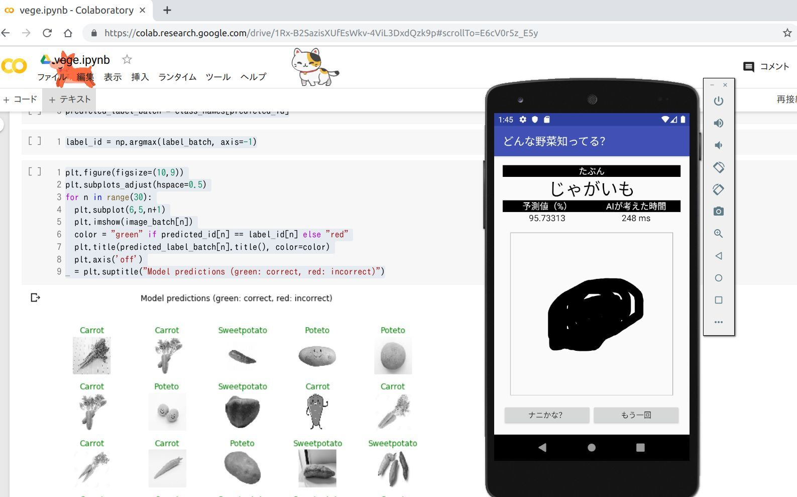

## AIを教育に使う事例（デモアプリ）

  

## 利用イメージ

野外体験や観察後、どれぐらい子どもたちの頭に ”野菜” の特徴が残っているか確認。
テストなどにも。

## MORE

ペンの細さ調整、色、記録、問題形式に、採点機能 etc...

## Run

Android Studio -> open "androidフォルダ"

## 仕様

+ Model / TensorFlow 2.0 , MobileNet V2,  -> .tflite
+ Label.txt / nothing, in code(Result.java)
+ PC / Google Colab(GPU)

## 参考

+ [model](https://www.tensorflow.org/tutorials/images/transfer_learning_with_hub), .pb まで
+ [.pb -> .tflite](https://www.tensorflow.org/lite/convert/python_api)
+ [set model to Android](https://github.com/nex3z/tflite-mnist-android)

